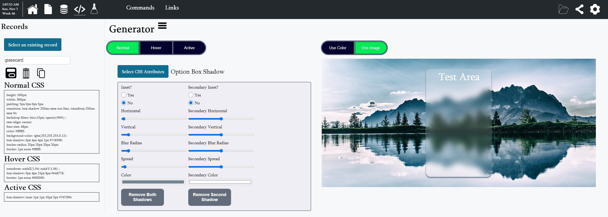

# Playground
Project to help with building other projects. Used for improving efficency by helping store information and easy way to test new features. 



## Sections
- Home: To do list and global timers will alerts that fire on any page. 
- File: Read and update files, perform string ops, regex, and json ops.
- Clipboard: Store collections of copy buttons, text, timer, urls, or commands
- Generator: Generate css
- Experiment: Test out new functionality/components and demo existing.
- Project: Git operations given directory.  Switch/Delete Branches, Create/Select Stash.
- Commands: list of commands to execute
- Links: list of favorite external links
- MockServer: Create, delete, and view mock endpoints
- Config: Sets what appears in Commands & Links dropdown.  Add and delete project directories

## utils
Re-usable pure functions will be saved stored here

## server
Simple server for allowing reading/writing, storing information, executing commands, etc. 

Copy the following to capture api call payloads.
```
post: (payload) => {
    return fetch('http://localhost:{port}/', {
      headers: {
        'Accept': 'application/json',
        'Content-Type': 'application/json'
      },
      body: JSON.stringify(payload),
      method: 'POST',
      crossDomain: true
    })
      .then(resp => resp.json())
      .catch(error => console.log('error:', error));
  }
```

## testing, q.js, script.js
Folder for quick testing of html as testing javascript functions. Node script for creating files from template, updating files with regex. 

## ToDo
Generator:
  - Flex/Grid
  - Neomorphism, Glassmorphism, Aurora
  - Add ability to change width of generator div
  - SVG Animator
  - Animation
  - Background Image Gradient Form
  - Default Values on Form load
  - Visibility: visible/hidden, cursor: pointer, overflow: auto/hidden

Template Tab:
  - View a template & Flexible edit of templates

Dropdown:
  - Pass different content
  - Show on hover

Config Page:
  - Set theme and update app with theme
	
Table:
  - Sort
  - Config (add/remove columns)
  - Export to csv

Wizard:
  - CSS for header, footer  
  - Progress Item List

Form Validation Hook

Package Tab:
  - Notified when a script finished

Unit Test:
  - InfoButton needs test